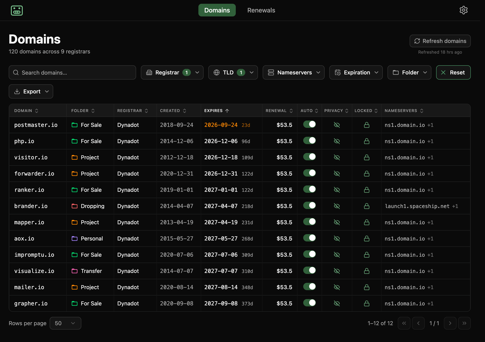

# DomBot

**All your domains, from every registrar, in one app + MCP.**

DomBot pulls your whole domain portfolio — scattered across GoDaddy, Dynadot,
Cloudflare, and more — into one desktop app, and serves the same portfolio to
your AI agents through a built-in MCP server. It's free, open source, and
local-first: your data and API keys stay on your machine.

**Download** for macOS, Windows, or Linux from
[**dombot.ai**](https://dombot.ai) or the
[Releases](https://github.com/aoxborrow/dombot/releases) page.



## What it does

- **One portfolio, every registrar.** Aggregates all your domains across the
  registrars you configure into a single sortable, filterable table — search by
  name, filter by TLD / registrar / nameserver, and see registrar, creation and
  expiry dates, auto-renew, transfer lock, WHOIS privacy, and nameservers side
  by side. Expiry dates are color-coded by urgency, and at-risk domains
  (expired, grace, redemption, hold) get a status badge.
- **Renewal costs at a glance.** A renewals dashboard forecasts your spend:
  yearly total, amount due in the next 90 days, a month-by-month renewal chart,
  and breakdowns by registrar and TLD. Prices come from registrar quotes where
  available and a base per-TLD price database otherwise, and you can enter a
  price by hand for anything still unpriced.
- **Export.** One click exports the current (filtered, sorted) view to a
  spreadsheet-friendly CSV.
- **Instant, offline-friendly launch.** The whole portfolio is cached on disk
  and painted the moment the app opens, with no network calls; you refresh on
  demand (it never auto-refreshes) and a timestamp flags when data is going
  stale.
- **Agent-ready.** An embedded local MCP server lets AI agents (Claude Code,
  Claude Desktop, any MCP client) read and manage the same portfolio — see
  [Embedded MCP server](#embedded-mcp-server).

## Configuring registrars

Add each registrar in **Settings → Registrars** with an API key from that
provider's account — DomBot shows where to find each one. Credentials are stored
encrypted on your device via Electron `safeStorage` (Keychain on macOS, DPAPI on
Windows) and are never sent anywhere but the registrar's own API.

---

# Development

DomBot is a cross-platform desktop app built with Electron Forge, React 19,
TypeScript (strict), and Vite, styled with Tailwind CSS v4 and Zustand for
state. Registrar API support comes from
[`@aoxborrow/registrar-client`](https://github.com/aoxborrow/registrar-client);
agents connect through an embedded MCP server. Contributions welcome.

## Scripts

| Command              | Description                                        |
| -------------------- | -------------------------------------------------- |
| `npm start`          | Run the app with hot reload (Forge + Vite)         |
| `npm run package`    | Package the app into an unpacked bundle            |
| `npm run make`       | Build distributables (zip/deb/rpm/Squirrel)        |
| `npm run lint`       | Lint `.ts`/`.tsx` files                            |
| `npm run format`     | Format the codebase with Prettier                  |
| `npm run typecheck`  | Type-check without emitting                        |
| `npm run site:build` | Minify the landing page (`site/src` → `site/dist`) |

## Credentials in development

In production, registrar credentials are entered in **Settings → Registrars**
and stored encrypted via Electron `safeStorage` — see
[`src/main/services/credentials.ts`](src/main/services/credentials.ts). For
local dev, `.env` (git-ignored, loaded via `dotenv`) is used as a fallback: the
resolver prefers a saved value and falls back to `<PROVIDER>_<FIELD>` from the
environment (see [`.env.example`](.env.example)). Either way the same
credentials feed both the UI and the MCP server.

## Embedded MCP server

The app runs a local [MCP](https://modelcontextprotocol.io) server so agents
(Claude Code, Claude Desktop, any MCP client) can manage the portfolio. It's a
third _adapter_ over the same `services/` core the UI uses — see
[`src/main/mcp/`](src/main/mcp).

- **Transport:** Streamable HTTP, bound to `127.0.0.1` only. Never exposed off
  the machine.
- **Auth:** OAuth 2.1 (dynamic client registration + PKCE), served by the app.
  On first connect a browser waiting page opens and **DomBot's own window shows
  an Approve/Deny prompt** (client name + a confirmation code that matches the
  browser page). Approve once and the client is paired; the issued token is
  persisted (`userData/mcp-tokens.json`) so it stays paired across restarts.
  Manage or revoke paired clients in **Settings → MCP Clients**. Env knobs:
  `DOMBOT_MCP_PORT` (default `4123`), `DOMBOT_MCP_ENABLED=0` to disable,
  `DOMBOT_MCP_AUTOAPPROVE=1` to skip the approval prompt (dev/testing),
  `DOMBOT_MCP_TOKEN` for a static bearer token escape hatch (dev/testing). See
  [`src/main/mcp/oauth.ts`](src/main/mcp/oauth.ts).
- **Tools.** Named by scope, so a caller can tell at a glance what a tool acts
  on: `portfolio_*` take no scope params, `registrar_*` require a `registrar`
  id, and `domain_*` require `registrar` + `domain`. `registrar` is always
  required (never resolved from state), so a client can act on a freshly
  registered name that isn't in the cached portfolio yet.
  - _Portfolio:_ `registrar_list`, `portfolio_list` (aggregated across
    configured registrars).
  - _Registrar reads:_ `registrar_test`, `registrar_domains`,
    `registrar_check_availability`, `registrar_pricing`.
  - _Domain reads:_ `domain_get`, `domain_contacts_get`,
    `domain_nameservers_get`, `domain_dns_get`, `domain_email_forwarding_get`,
    `domain_url_forwarding_get`, `domain_renewal_price` (DomBot's own estimate,
    distinct from `registrar_pricing`).
  - _Writes (non-money):_ `domain_nameservers_set`, `domain_dns_set`,
    `domain_contacts_set`, `domain_email_forwarding_set`,
    `domain_url_forwarding_set`, `domain_set_autorenew`, `domain_set_lock`,
    `domain_set_privacy`. Forwarding (email alias and URL redirect) is
    per-registrar — unsupported providers return an error.
  - _Writes (money):_ `registrar_register_domain`, `registrar_transfer_domain`,
    `domain_renew`. Not gated behind extra per-call approval — the
    connection-level OAuth approval is the gate — and annotated non-idempotent.
- **Credentials.** A client is built per registrar from `.env` using each
  provider's `configFields` and the `<PROVIDER>_<FIELD>` naming convention (see
  [`.env.example`](.env.example)). "Configured" means all required vars present.

The URL and a ready-to-paste connect command are shown on the Home screen. To
connect Claude Code (no token needed — approve in the page that opens):

```bash
claude mcp add dombot --transport http http://127.0.0.1:4123/mcp
```

## License

DomBot is free and open source software: Copyright (C) 2026 Aaron Oxborrow,
licensed under the [GNU Affero General Public License v3.0 or later](LICENSE)
(AGPL-3.0-or-later). You may use, study, share, and modify it; if you distribute
a modified version, it must also be AGPL and ship its source.

Any paid data feeds are a separate, optional add-on service with their own terms
— the app itself is and stays free. The registrar logic in
[`@aoxborrow/registrar-client`](https://github.com/aoxborrow/registrar-client)
is a separate project under the MIT license.
